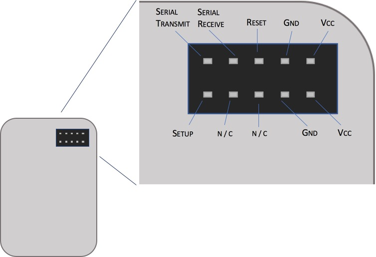
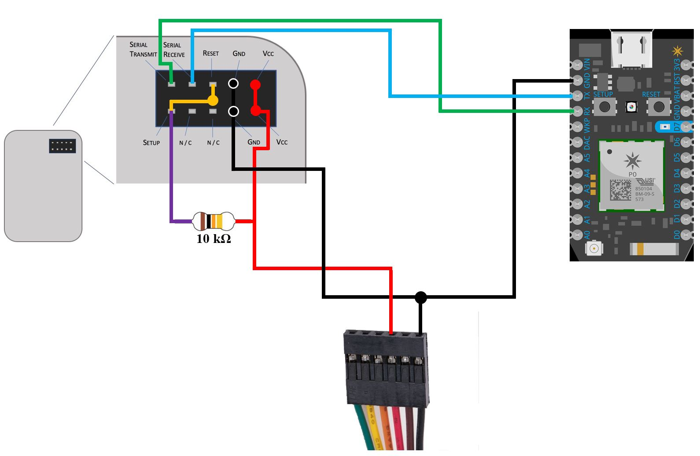
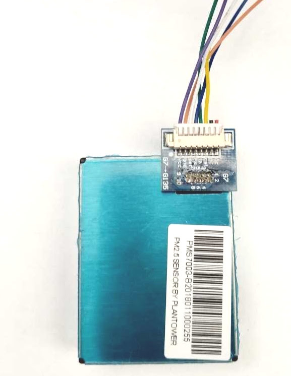
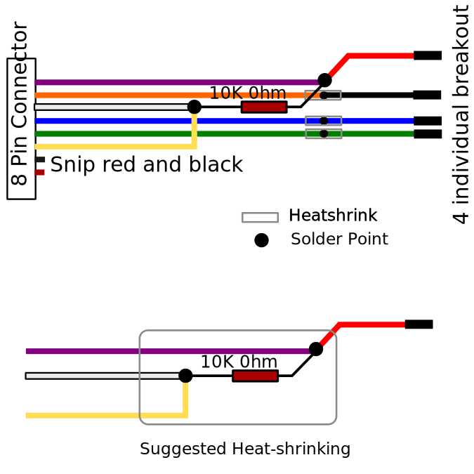
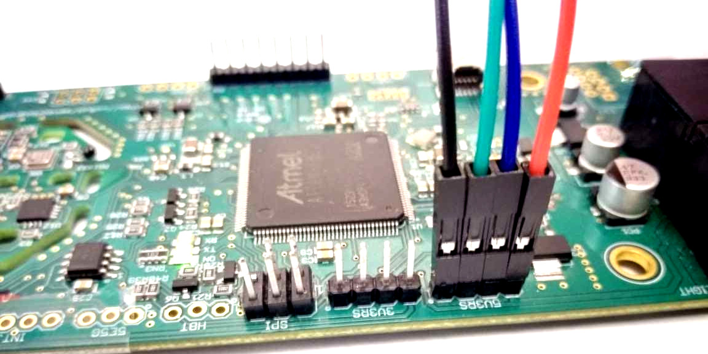

# *PMS7003 Sensor*
## Part I. General Overview
### What is the PMS7003?

  * Airborne particulate matter sensor  
  * Senses based on the principle of laser scattering 
  * Requires a 5V power supply 
  * Detects fine particulate matter (width of particles < 2.5 microns)
  * Returns PM2.5 concentration of standard particulate matter and in atmospheric environment in μg/m³

### Datasheet
[PMS 7003 Datasheet](https://github.com/charihara/Experimental_Sensors/blob/master/Datasheets/PMS_7003_Datasheet.pdf)
### Connection Images




### Working Logic / Functionality
#### Output

  * Type: UART
  * Default baud rate: 9600 bps; Parity: None; Stop bit: 1 bit 
  * Length: 32 bytes 
    * Data 1 high octet --> Data 1 indicates PM1.0 concentration (CF = 1, standard particles)
    * Data 1 low octet --> Unit μ g / m3
    * Data 2 high octet --> Data 2 indicates PM2.5 concentration (CF = 1, standard particulate matter)
    * Data 2 low octet --> Unit μ g / m3
    * Data 3 high octet --> Data 3 indicates PM10 concentration (CF = 1, standard particulate matter)
    * Data 3 low eight bits --> Unit μ g / m3
    * Data 4 high octet --> Data 4 indicates PM1.0 concentration (in atmospheric environment)
    * Data 4 low octets --> Unit μ g / m3
    * Data 5 high octet --> Data 5 indicates PM2.5 concentration (in atmospheric environment)
    * Data 5 low octets --> Unit μ g / m3
    * Data 6 high octet --> Data 6 indicates PM10 concentration (in atmospheric environment)
    * Data 6 is low octet --> Unit μ g / m3
    * Data 7 high octet --> Data 7 indicates that 0.1 liter of air has a diameter above 0.3um
    * Data 7 is low octet --> The number of particles
    * Data 8 high octet --> Data 8 indicates that 0.1 liter of air has a diameter of 0.5um or more
    * Data 8 is low --> The number of particles
    * Data 9 high octet --> Data 9 indicates that 0.1 liter of air has a diameter of 1.0um or more
    * Data 9 is low octet --> The number of particles
    *	Data 10 high octet --> Data 10 indicates that the diameter of 0.1 liter of air is above 2.5um
    *	Data 10 low octets --> The number of particles
    *	Data 11 High octet --> Data 11 indicates that 0.1 liter of air has a diameter of 5.0um or more
    *	Data 11 is low octet --> The number of particles
    *	Data 12 high octet --> Data 12 indicates that 0.1 liter of air has a diameter above 10um
    *	Data 12 is low octet --> The number of particles
    *	Data 13 high octet --> version number
    *	Data 13 low octets --> error code
    *	Data and check high eight --> Check code = start character 1 + start character 2 + ... .. + data 13 low
    *	Data and check low eight --> Eight

## Part II. Waggle Specific
### Application
#### How does my sensor work with a Particle Photon?
[Documentation detailing how to setup and read data from the Particle Photon can be found here.](https://github.com/charihara/Experimental_Sensors/blob/master/Photon_Instructions.md)
#### How does my sensor work with a Particle Electron?
[Documentation detailing how to setup and read data from the Particle Electron can be found here.](https://github.com/charihara/Experimental_Sensors/blob/master/Electron_Instructions.md)

### Source Code from particle.io

```C 
#include "Particle.h"
#define LENG 32

char buf[LENG + 2];
int data_CRC = 0x00;

void setup()
{
 Serial1.begin(9600);
}

void loop()
{

 if (Serial1.available() > 0)
 {
 
  if (Serial1.read() == 0x42)
  {
   Serial1.readBytes(buf,LENG-1);
   
   if(buf[0] == 0x4d)
   {
    data_CRC = 0x42;
    
    for ( int i = 0x00; i < LENG -3 ; i ++)
    {
     data_CRC = data_CRC + buf[i] ; 
    }   
    
    if ( data_CRC == (( buf[LENG - 3] << 8 ) + buf[LENG - 2]))
    {
     String data_send;
     
     for (unsigned char i = 0x00; i < LENG; i++)
     {
     
      if (buf[i] < 0x10)
      {
       data_send = data_send + '0';
      }
      data_send = data_send + String(buf[i],HEX);
     } 
     Particle.publish("PMS7003", data_send, PRIVATE);
    }
   }
  }
 }
 delay(500);
}	
```

### Particle Data Interface with Beehive dev <a name="beehive"></a>
[Particle to Beehive dev source code](https://github.com/JordanFleming/sensor_documentation/blob/master/Particle_to_Beehive_plugin)
### Waggle-space ID
[Sensor ID Table](https://github.com/JordanFleming/sensor_documentation/blob/master/Sensor_IDs.md)


## Physical Connection with Metsense Board: 
#### Parts:
 - Sensor with breakout board and F-F breakout wire from [AliExpress ](https://www.aliexpress.com/item/1-set-Laser-PM2-5-PMS7003-G7-High-precision-laser-dust-concentration-sensor-digital-dust-particles/32826370928.html)
 - Breakout Wires from Digikey - [1568-1588-ND](https://www.digikey.com/product-detail/en/sparkfun-electronics/PRT-09390/1568-1588-ND/5993852)
 - 10K Resistor from Digikey - [CF14JT10K0CT-ND](https://www.digikey.com/product-detail/en/stackpole-electronics-inc/CF14JT10K0/CF14JT10K0CT-ND/1830374)
 
 - Heatshrink from Digikey - [A018B-4-ND](https://www.digikey.com/product-detail/en/alpha-wire/F221B1-8-BK100/A018B-4-ND/281671)

#### Breakout Board Attachement to PM7003:

The figure below shows the attachment of the breakout board to the PMS7003 sensor. 




### Connection Mods: 

The 8-wide wire above has to be converted to a 4 wire attachment to connect to the Metsense Board on **Port 5V5RS (data and power)**. This port provides 5 V power and uses 3V logic for RS-232 communication. It is attached to **Serial 2** interface on the ARM processor. 
The red and black wires from the header above are snipped. 




```
1. Purple -- VCC --- Red Wire to Metsense, PIN 4 of 5V5RS
2. Orange -- GND --- Black Wire to Metsense, PIN 1 of 5V5RS
3. White -- Setup --- Add 10K resistor and connecet to VCC
4. Blue -- RX --- Blue Wire to TX on Metsense, PIN 3 of 5V5RS
5. Green -- TX --- Green Wire to RX on Metsense, PIN 2 of 5V5RS
6. Yellow -- RST --- Short to Setup (White Above)
7. Black --- NC
8. Red --- NC
```

### Metsense Board Attachment:
Use all four pins of 5V5RS:
```
GND --- Black Wire to Metsense, PIN 1 of 5V5RS
TX --- Green Wire to RX on Metsense, PIN 2 of 5V5RS
RX --- Blue Wire to TX on Metsense, PIN 3 of 5V5RS
VCC --- Red Wire to Metsense, PIN 4 of 5V5RS
```
The figure below shows the attachment of the PMS7003 cable to Metsense. 



**Length of wire-bundle nedeed : 10 inches end-to-end. **


